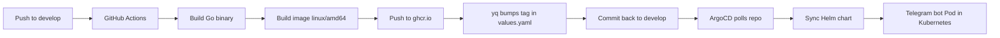

## CI/CD Pipeline

```mermaid
flowchart LR
    A[Push to develop] --> B[GitHub Actions]
    B --> C[Build Go binary]
    C --> D[Build image linux/amd64]
    D --> E[Push to ghcr.io]
    E --> F[yq bumps tag in values.yaml]
    F --> G[Commit back to develop]
    G --> H[ArgoCD polls repo]
    H --> I[Sync Helm chart]
    I --> J[Telegram bot Pod in Kubernetes]
```